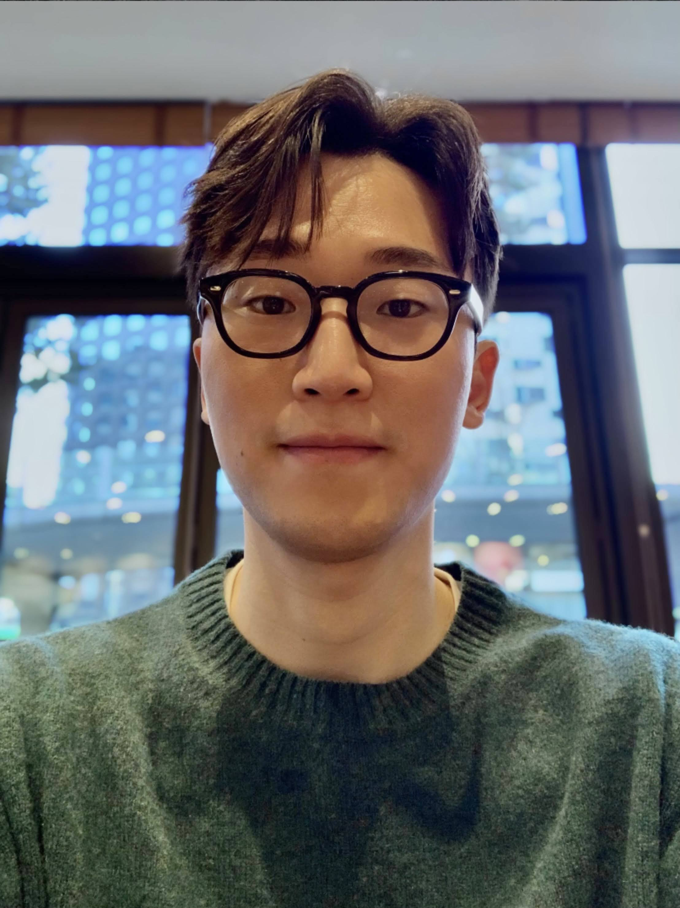

    
    <h2>Shuoqi Chen</h2>

    Shuoqi Chen is a Computer Vision Medical Imaging engineer at Intuitive Surgical, Inc., specializing in the intersection of advanced imaging technologies and robotic-assisted medical procedures. He earned his graduate degree from the Robotics Institute at Carnegie Mellon University, and has since worked on integrating advanced medical imaging modalities to clinical solutions for minimally invasive lung biopsies. Shuoqi is an active presenter and reviewer in a number of robotics and AI conference, including IEEE TRO, IROS, CVPR, and ICML.

 <b>Contact</b>: shuoqi.chen@intusurg.com

    
    <h2>Jihun Yoon</h2>

    Jihun Yoon is an AI research engineer at Hutom in Seoul, South Korea. His main focus is on developing techniques for surgical scene understanding that enable a quantitative evaluation of surgeries. One of his main research objectives is to improve model generalization through understanding datasets. Jihun and his team at Hutom have recently published the SISVSE dataset at MICCAI 2022, which is currently the largest robotic gastrectomy segmentation dataset and makes use of virtual surgery synthetic data. Jihun was also awarded for winning the object detection in video challenge at EPICKitchens Challenges, CVPR 2020, with a novel semi-supervised learning method for sparsely annotated datasets.

 <b>Contact</b>: yjh2020@hutom.io

    
    <h2>Rogerio Nespolo</h2>

    Rogerio Nespolo is a biomedical engineering PhD candidate and researcher at the University of Illinois Chicago. His work is focused on real-time surgical guidance and surgeons’ skills assessment for eye surgery and robot-assisted procedures employing multiple data modalities - image, kinematics, and visual attention - via computer vision and deep learning. His interests also include the investigation of biased datasets in the surgical field and its impact on minority populations.

 <b>Contact</b>: rgarci67@uic.edu

    
    <h2>Rohit Jena</h2>

    Rohit Jena is a 3rd year Ph.D. student in Computer and Information Science at University of Pennsylvania. He is currently working on medical image registration, segmentation, and scaling up deep learning algorithms to 3D data. Previously, he has worked on problems including evaluation in instance segmentation, segmentation in neurosurgery, self-supervised representation learning for vascular segmentation, and exact aleatoric uncertainty estimation for medical image segmentation. Rohit is an active contributor in a number of AI conferences and journals like CVPR, MICCAI, IPMI, CoRL, MedIA, and has reviewed papers in CVPR, ECCV, ICCV, IJCV, ICML, ICLR, NeurIPS and MICCAI.

 <b>Contact</b>: rjena@seas.upenn.edu

    
    <h2>Wanwen Chen</h2>

    Wanwen Chen is a PhD candidate in Electrical and Computer Engineering at the University of British Columbia, Canada, researching ultrasound imaging and augmented reality with Dr. Tim Salcudean. Her research focuses on classical and deep learning methods for ultrasound imaging and augmented reality for transoral robotic surgery, and her research is conducted in close collaboration with Vancouver General Hospital. She has been a reviewer in medical imaging and medical robotics conferences and workshops (ISMR, AE-CAI). She has various experience in event and conference organization (volunteer in MICCAI 2023, Vice President Academic in ECE Graduate Student Association at UBC, etc.).

 <b>Contact</b>: wanwenc@ece.ubc.ca

    
    <h2>Dominik Rivoir</h2>

    Dominik Rivoir is a 5th-year PhD student at the National Center for Tumor Diseases in Germany as well as the Centre for Tactile Internet of TU Dresden, Germany. His research includes unsupervised methods for neural rendering and data synthesis in surgical computer vision applications. He has actively contributed to both the main computer vision field as well as medical applications, having published at ICCV, MICCAI and IPCAI and being a regular reviewer at venues such as CVPR, ICCV, ECCV, MICCAI, MedIA, TMI or IPCAI

 <b>Contact</b>: dominik.rivoir@nct-dresden.de

[back](./)

