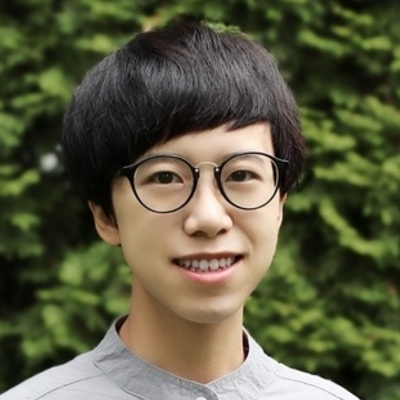
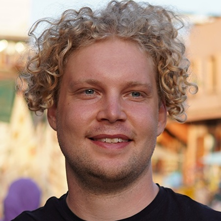
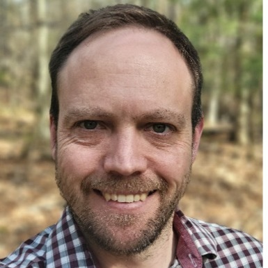
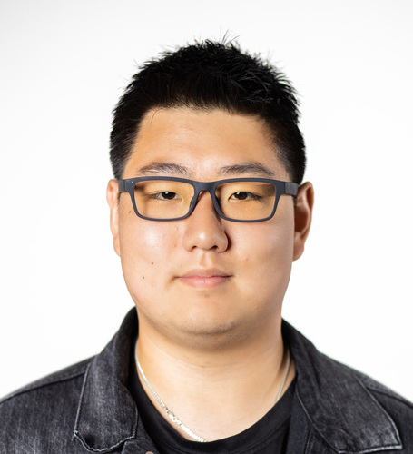
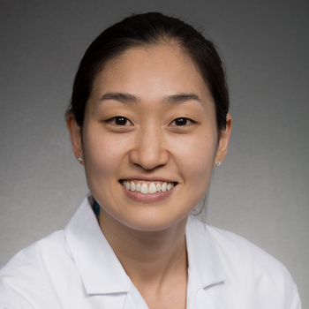

## Schedule

**Date**: June 17, 2024
**In-personal attendance**: [Location TBD]
**Virtual attendance**: [Zoom link TBD]
 
**Opening Remarks**
1:00 PM – 1:15 PM

**Keynotes**
1:15 PM – 2:30 PM
- James Zou (Stanford University) 
- Anthony Jarc (Intuitive Surgical)

**Panel Discussion**
2:30 PM – 3:30 PM
- Tim Rädsch (German Cancer Research Center and Helmholtz Imaging)  
- Xiaoxiao Li (University of British Columbia) 
- Geoffry Luke (Dartmouth/DHMC) 
- Darvin Yi (University of Illinois at Chicago)
- Cecilia Lee (University of Washington)

**Interim Break**

**Paper Oral Presentations**
4:00 PM – 4:50 PM

**Paper Award Announcement**
4:50 PM – 5:00 PM

**Ending Notes**
5:00 PM – 5:05 PM

**Poster Presentations** 
5:00 PM – 6:00 PM

**Poster Award Announcement**
5:45 PM – 6:00 PM

<em>**Schedule details may subject to change**<em>

## Panelists

    
    <h3>Xiaoxiao Li</h3>

    Xiaoxiao Li is currently an assistant professor at the University of British Columbia, a faculty member at Vector Institute, and an adjunct assistant professor at the School of Medicine at Yale University. Xiaoxiao’s research interests lie at the intersection of AI and healthcare, developing next-generation responsible AI algorithms and systems and publishing at machine learning conferences (ICML, ICLR, NeurIPS, CVPR, ECCV, etc.), as well as biomedical conferences and journals (MICCAI, IPMI, Medical Image Analysis, IEEE Trans on Medical Imaging, Nature Methods). Xiaoxiao’s research has been recognized in several best paper awards, Meta Research Awards, and Canada CIFAR AI Chair Awards.

    
    <h3>Tim Rädsch</h3>

    Tim is a PhD student at the German Cancer Research Center and Helmholtz Imaging. With experience in building a 25-person engineering team at a German AI startup and a master from KIT, he rigorously validates ML algorithms by developing best-in-class training and testing pipelines. His accolades include the Anton Fink Science for AI Award 2023, Falling Walls Science Breakthrough of the Year 2023 Finalist, a Hanns Seidel research fellowship, and a Best Flash Talk Award at the ELLIS Health conference in Heidelberg. His contributions are published in venues like Nature Machine Intelligence, Nature Methods, CVPR, and NeurIPS.

    
    <h3>Geoffrey Luke</h3>

    Geoffrey P. Luke, PhD is an Associate Professor of Engineering Sciences in the Thayer School of Engineering at Dartmouth College. He earned a BS in Computer Engineering and Mathematics and a MS in Electrical Engineering from the University of Wyoming. He went on to complete his PhD at the University of Texas at Austin. He currently leads the Functional and Molecular Imaging Laboratory, with research focusing on the intersection of ultrasound, optics, and nanotechnology. Current projects seek to leverage computational and deep-learning approaches for improved biomedical imaging.

    
    <h3>Darvin Yi</h3>

    Darvin Yi is an Assistant Professor in the Department of Ophthalmology and Visual Sciences at the University of Illinois at Chicago.  He also serves as a Co-Executive Director of the Artificial Intelligence in Ophthalmology (Ai-O) Center and Assistant Director in the AI.Health4All Center for Health Equity in Machine Learning and AI.  His lab focuses on algorithm development for imaging problems in all forms of biomedical imaging.  Specifically, his research concentrates on small data deep learning, out of distribution robustness, long tail data robustness, and explainable AI.

    
    <h3>Cecilia Lee</h3>

    Dr. Lee is a Professor of Ophthalmology and the Klorfine Family Endowed Chair in the Department of Ophthalmology at University of Washington. Dr. Lee is a clinical epidemiologist and medical retina/uveitis specialist and co-leads Computational Ophthalmology Lab which focuses on machine learning/big data research in transdisciplinary fields such as ophthalmic imaging, neuroradiology, and neuropathology. Her research interests include “Big Data” research involving electronic medical records and non-invasive imaging datasets in retina. She is passionate about investigating the relationship between the aging eyes and the aging brains to better understand the neurodegenerative pathologies such as age-related macular degeneration (AMD) and Alzheimer’s disease.

[back](./)